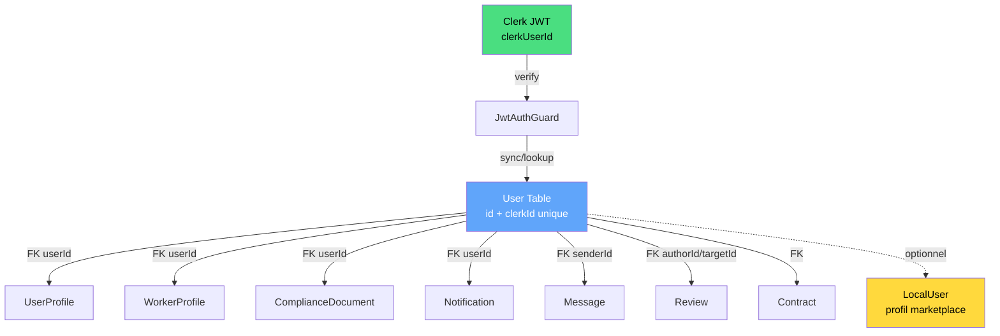

# PR-0: Design Decisions

> **Date:** 2026-01-18  
> **Status:** DÉCISION FIGÉE  
> **Scope:** Architecture Identity & Data Linking

---

## Design Decision: Identity & Data Linking

### Règle officielle

```
┌─────────────────────────────────────────────────────────────────┐
│  AUTH = CLERK UNIQUEMENT                                        │
│  - clerkUserId est la clé unique d'identité                     │
│  - JWT Clerk → vérifié par ClerkAuthService                     │
│  - req.user.sub = User.id (interne, lié à clerkId)             │
└─────────────────────────────────────────────────────────────────┘
```

### Pattern de liaison des données



### Clarifications

| Concept | Définition |
|---------|------------|
| `clerkUserId` | Identifiant unique Clerk (source of truth auth) |
| `User.id` | ID interne backend (format: `user_xxx`) |
| `User.clerkId` | Référence vers Clerk (unique) |
| `LocalUser` | **Optionnel** - profil marketplace/métier, **PAS** pour l'auth |

### Ce qui est INTERDIT

1. ❌ Créer `LocalMessage`, `LocalReview`, `LocalComplianceDocument` pour contourner les FK
2. ❌ Routing conditionnel basé sur `userId.startsWith('local_')`
3. ❌ Merge/unification des tables `User` et `LocalUser`
4. ❌ Proposer "certaines features Clerk-only"
5. ❌ Auth email/password comme système principal

### Ce qui est AUTORISÉ

1. ✅ Utiliser Clerk JWT pour toute authentification
2. ✅ Lier `LocalUser` à `clerkUserId` si besoin de données marketplace
3. ✅ Ajouter un champ `clerkUserId` à `LocalUser` pour liaison (si nécessaire)
4. ✅ Réutiliser les modules existants (Message, Review, etc.) qui ont FK → User

---

## Implication sur les GAPs identifiés

### Messages

**Situation actuelle:**
- Module `src/messages/` existe ✅
- Endpoints: `GET /messages/thread/:missionId`, `POST /messages`, etc.
- Model `Message` avec FK `senderId → User.id` ✅
- Service utilise `clerkUserId` pour lookup ✅

**Avec Clerk auth:**
- `req.user.sub` = `User.id` (sync par ClerkAuthService)
- `Message.senderId` = `User.id` → **FONCTIONNE** ✅

**Conclusion:** Module Messages **compatible** avec Clerk auth. Pas de création de `LocalMessage`.

### Reviews

**Situation actuelle:**
- Model `Review` existe avec FK `authorId → User.id`, `targetUserId → User.id` ✅
- **AUCUN endpoint** (controller/service absents)

**Avec Clerk auth:**
- On peut créer le module Reviews qui utilise `req.user.sub` = `User.id`
- Pas besoin de `LocalReview`

**Conclusion:** CREATE module Reviews (endpoints + service), utiliser model `Review` existant.

### Compliance

**Situation actuelle:**
- Module existe ✅
- Model `ComplianceDocument` avec FK `userId → User.id` ✅
- **BYPASS actif** pour `local_*` IDs (workaround temporaire)

**Avec Clerk auth:**
- `req.user.sub` = `User.id` → FK valide
- Le bypass devient **inutile**

**Conclusion:** ADAPT - supprimer le bypass, le module fonctionne nativement avec Clerk auth.

### Devices/Push

**Situation actuelle:**
- Aucun model, aucun endpoint

**Avec Clerk auth:**
- Créer model `DeviceToken` avec FK `userId → User.id`
- Créer module Devices

**Conclusion:** CREATE model + module, lié à User.id.

---

## Preuve dans le code

### ClerkAuthService retourne User.id

```typescript
// src/auth/clerk-auth.service.ts:114-120
return {
  sub: user.id,      // ← User.id interne, PAS clerkId
  clerkId,
  email: email ?? `${clerkId}@clerk.local`,
  role,
  claims: payload,
};
```

### User.clerkId est unique

```prisma
// prisma/schema.prisma:344-346
model User {
  id       String @id
  clerkId  String @unique  // ← Liaison Clerk
  ...
}
```

### Message.senderId référence User.id

```prisma
// prisma/schema.prisma:497-508
model Message {
  id         String @id
  missionId  String
  senderId   String
  ...
  sender     User   @relation(fields: [senderId], references: [id], onDelete: Cascade)
}
```

---

## Résumé

| Question | Réponse |
|----------|---------|
| Quel système d'auth? | Clerk uniquement |
| Que représente `req.user.sub`? | `User.id` (interne) |
| Comment lier les données? | Via FK → `User.id` |
| Faut-il des modèles `Local*` pour Messages/Reviews? | **NON** |
| Le bypass compliance est-il nécessaire? | **NON** (si Clerk auth) |

